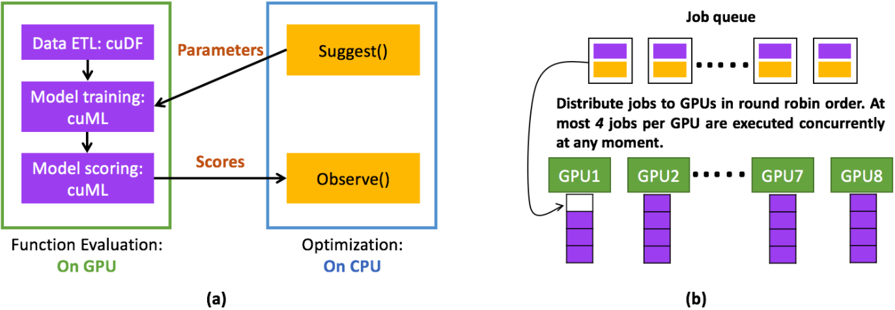
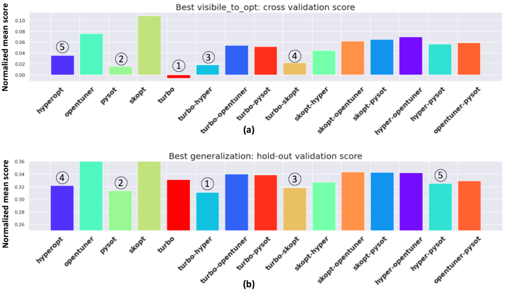
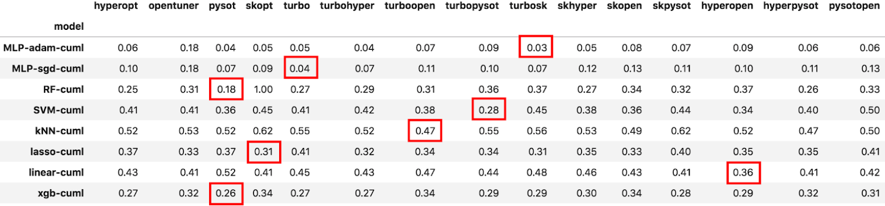
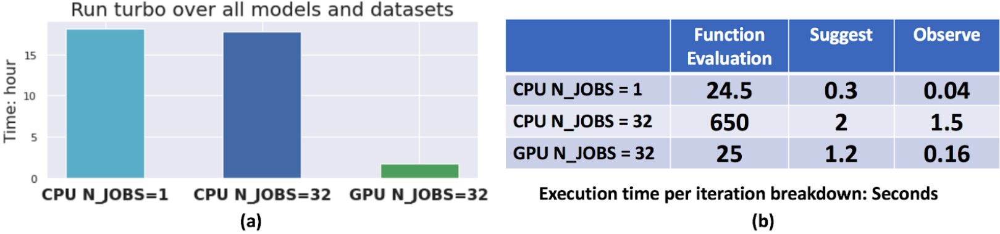
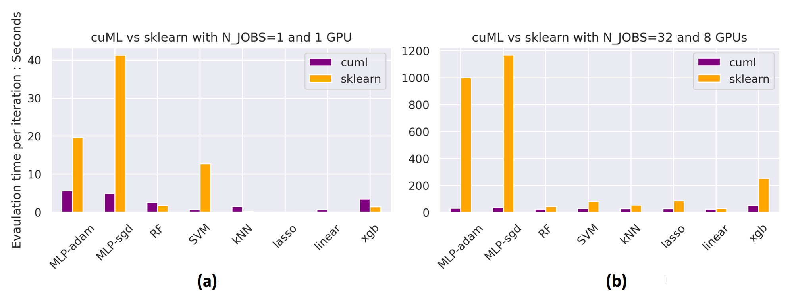

# 
&nbsp;NVIDIA RAPIDS.AI Solution of BBO NeurIPS 2020

We won **the [2nd place of the NeurIPS 2020 competition](https://bbochallenge.com/leaderboard)**: **Find the best black-box optimizer (BBO) for machine learning**.🎉 
We proposed a simple ensemble algorithm of black-box optimizers that outperforms any single optimizer but within the same timing budget. 
Evaluation of optimizers is a computing-intensive and time consuming task since the number of test cases grow exponentially with models, datasets and metrics. In our case, we need to **evaluate 15 optimizers, execute 4,230 jobs, train 2.7 million models and run 541,440 optimizations (suggest-observe)**. Utilizing the [RAPIDS](rapids.ai) libraries [cuDF](https://github.com/rapidsai/cudf) and [cuML](https://github.com/rapidsai/cuml), our GPU Accelerated exhaustive search is capable of finding the best ensemble in reasonable time. On a DGX-1, the search time is **reduced from more than 10 days on two 20-core CPUs to less than 24 hours on 8-GPUs.**

### Introduction
In this [competition](https://bbochallenge.com), black-box optimization algorithms are evaluated on real-world objective functions, using a benchmark system built on top of the AutoML challenge workflow and the [Bayesmark package](https://github.com/uber/bayesmark). This competition has widespread impact as black-box optimization is relevant for hyper-parameter tuning in almost every machine learning project (especially deep learning). The leader board will be determined using the optimization performance on held-out (hidden) objective functions, where the optimizer must run without human intervention. 

### Final Submission
Our final submission is an ensemble of optimizer [TuRBO](https://github.com/uber-research/TuRBO) and [scikit-optimize](https://scikit-optimize.github.io/stable/). [Code](https://github.com/daxiongshu/rapids-ai-BBO-2nd-place-solution/tree/master/example_submissions/turbosk) is in `example_submissions/turbosk`.

### Solution Overview
Our solution includes two parts:
- A multi-GPU optimized exhaustive search algorithm (this repo).
- Rapids-enabled Bayesmark ([rapids branch](https://github.com/daxiongshu/bayesmark/tree/rapids)) 

  GPU acceleration of BBO. (a) GPUs are used to execute computing intensive function evaluations with cuDF and cuML libraries. (b) Parallel execution of function evaluation and optimization on multiple GPUs.

### Install Instructions
#### Create a conda Environment
- conda create -n bbo_rapids python=3.7
- conda activate bbo_rapids
#### Install cudf, cuml and pytorch
- conda install "pytorch=1.6" "cudf=0.16" "cuml=0.16" cudatoolkit=10.2.89 -c pytorch -c rapidsai -c nvidia -c conda-forge -c defaults
#### Install optimization algorithms
- pip install gpytorch==1.2.1
- pip install git+https://github.com/uber-research/TuRBO.git@master
- pip install pySOT==0.2.3 opentuner==0.8.2 nevergrad==0.1.4 hyperopt==0.1.1 scikit-optimize==0.5.2 scikit-learn==0.20.2 xgboost==1.2.1
#### Install rapids-enabled Bayesmark
- git clone https://github.com/daxiongshu/bayesmark
- cd bayesmark
- git checkout rapids
- ./build_wheel.sh
- python setup.py install

### How to Run the Code
- please change the global variable `NUM_GPUS` in `run_one_opt.py` accordingly
- run a quick sanity check experiment with `python run_one_opt.py`, which takes 6 mins on a dgx-1.
- run the exhaustive search with `python run_exhaustive_search.py`. which takes less than 24 hours on a dgx-1.

### Key Findings
1. The ensemble of optimizers outperform single optimizers in terms of generalization performance.

Performance of optimization algorithms in terms of (a) cross validation score that is visible to and minimized by optimizers and (b) holdout validation score which represents the generalization ability of the optimizer. The y-axis is [normalized mean score](https://bayesmark.readthedocs.io/en/latest/scoring.html#mean-scores) and lower is better. The top 5 optimizers are highlighted in each sub-figure.

  

2. Optimizers are good at different machine learning models.

Generalization performance of optimizers on each cuML model. The best optimizer for each model (per row) is highlighted.

 

3. The overall execution time is dominant by model evaluation rather than optimization

  (a) Running time comparison between the proposed multi-GPU implementation and multi-core CPU implementation. (b) The breakdown of execution time per iteration.

  

  Run time comparison of cuML vs sklearn models.

We chose `turbo-skopt` as our final submission because 
- it has a Top-3 generalization score.
- it converges faster than single optimizers.
- it achieves best performance for a representative deep learning model.
